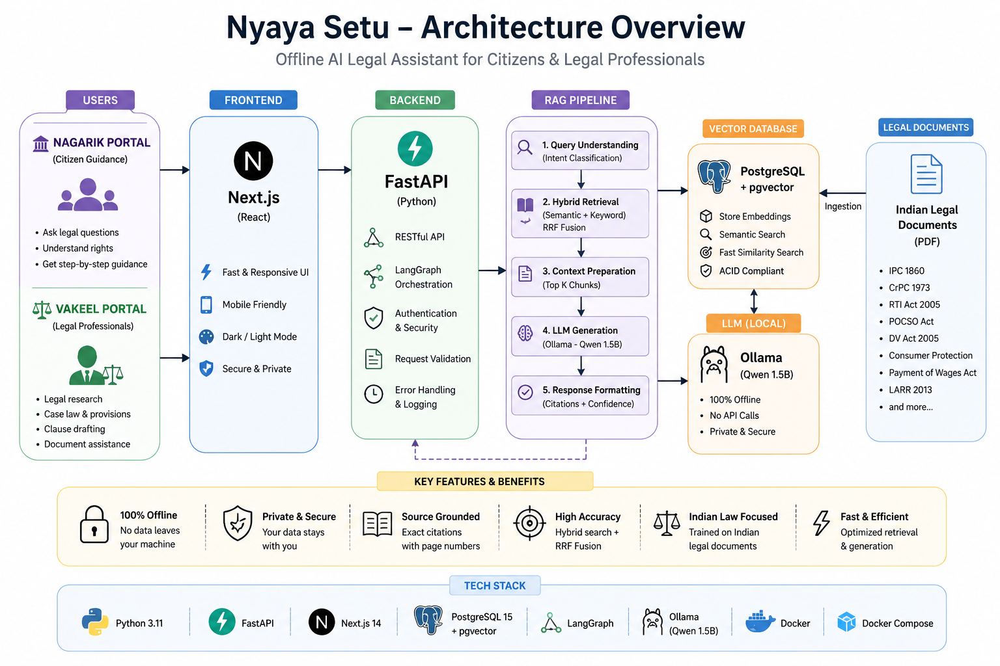
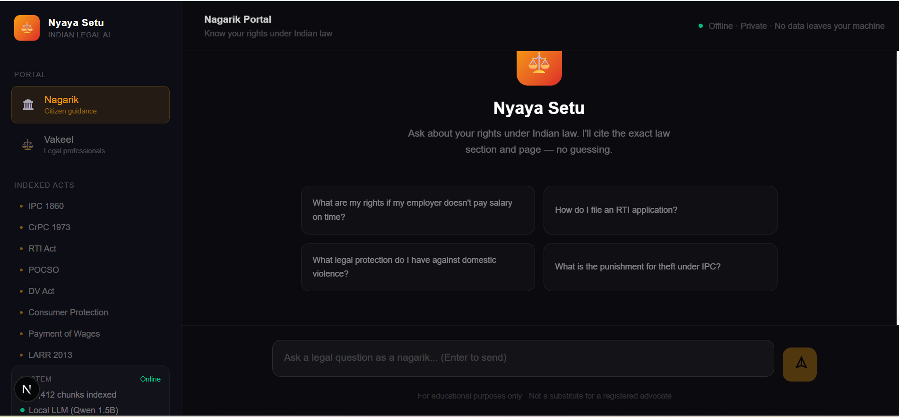
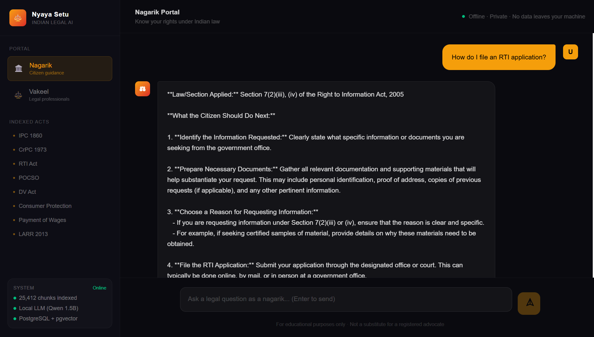
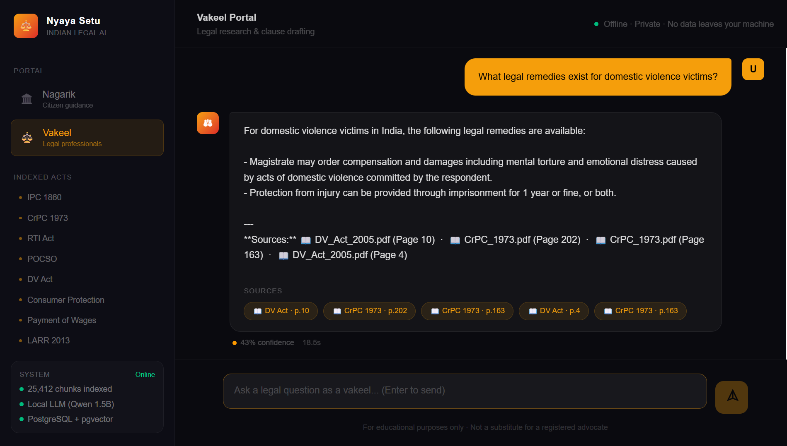
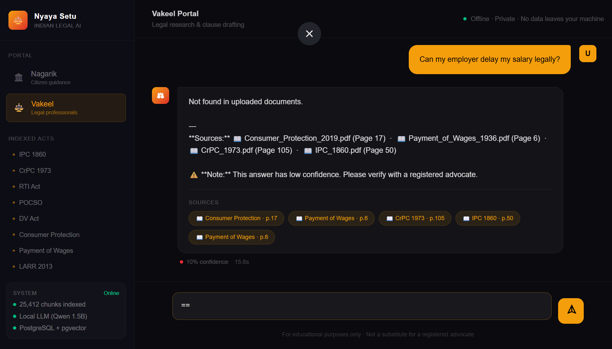
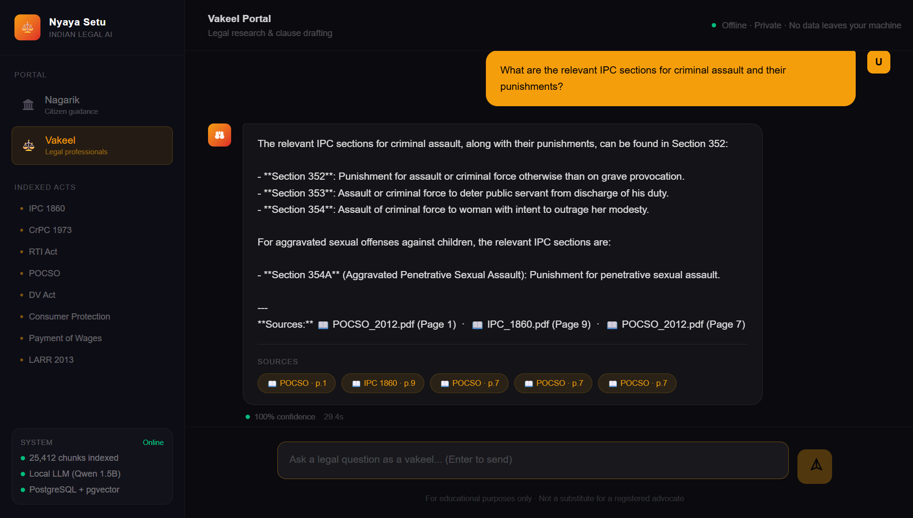

# ⚖️ Nyaya Setu – Indian Legal AI

> Private Offline AI Legal Assistant for Citizens & Legal Professionals


Nyaya Setu is an offline, privacy-first AI legal assistant built for Indian citizens and legal professionals using Retrieval-Augmented Generation (RAG).

The platform enables:
- 👨‍⚖️ Citizens to understand legal rights and procedures
- 🧑‍💼 Legal professionals to perform legal research and drafting
- 🔐 Fully offline legal AI inference with private document retrieval

The system provides:
- grounded legal answers
- exact legal citations
- page references
- confidence scoring
- hybrid semantic retrieval
- local AI inference using Ollama

---

# ✨ Features

- 🔍 Hybrid RAG Retrieval
- 📚 Source-Grounded Legal Answers
- 📄 Exact PDF + Page Citations
- ⚖️ Dual Portals:
  - Nagrik Portal (Citizen Guidance)
  - Vakeel Portal (Legal Research)
- 🧠 Local LLM using Ollama (Qwen 1.5B)
- 🗂️ PostgreSQL + pgvector Semantic Search
- 🔐 Fully Offline & Private
- 📑 Legal Clause Drafting
- 📊 Confidence Scoring
- ⚡ FastAPI Backend + Next.js Frontend
- 📱 Responsive User Interface
- 🚫 No External API Calls

---

# 🏗️ Architecture Overview



---

# 🛠️ Tech Stack

## Frontend
- Next.js
- Tailwind CSS
- TypeScript

## Backend
- FastAPI
- LangGraph
- Python

## Database
- PostgreSQL
- pgvector

## AI Stack
- Ollama
- Qwen 1.5B
- sentence-transformers

## Infrastructure
- Docker
- Docker Compose

---

# 📂 Project Structure

```text
nyaya-setu/
│
├── backend/
├── frontend/
├── docs/
│   └── images/
├── data/
├── scripts/
├── docker/
├── README.md
└── docker-compose.yml
```

---

# 📸 Screenshots

## 🧑 Nagrik Portal

### Home Page



---

### RTI Application Guidance



---

### Domestic Violence Rights



---

### Salary Rights & Employer Delays



---

## ⚖️ Vakeel Portal

### IPC Sections & Punishments



---

# 🧪 Testing & Evaluation

## RTI Guidance Query

- Tested legal procedural guidance
- Verified source citation retrieval
- Verified page-number grounding


---

## Domestic Violence Protection Query

- Tested citizen legal guidance
- Verified contextual legal retrieval


---

## IPC Legal Research Query

- Tested vakil research workflow
- Verified IPC section retrieval
- Verified legal citation generation


---

## Salary Rights Query

- Tested labor law retrieval
- Verified Payment of Wages Act references


---

## Hallucination / Out-of-Domain Testing

The system was intentionally tested using non-legal questions to evaluate hallucination resistance and confidence handling.

Example:
- "What is quantum physics?"

Observation:
- The model produced lower confidence responses compared to grounded legal answers.

This demonstrates:
- confidence scoring functionality
- domain sensitivity
- retrieval-based grounding behavior


---

# 📚 Indexed Indian Laws

Currently indexed legal acts include:

- IPC 1860
- CrPC 1973
- RTI Act 2005
- POCSO Act
- Domestic Violence Act
- Consumer Protection Act
- Payment of Wages Act
- LARR 2013

Current vector database size:
- 25,000+ indexed legal chunks

---

# 🚀 Quick Start

## 1. Clone Repository

```bash
git clone https://github.com/YOUR_USERNAME/nyaya-setu.git
cd nyaya-setu
```

---

## 2. Start Services

```bash
docker-compose up --build
```

---

## 3. Run Backend

```bash
cd backend
uvicorn app.main:app --reload --port 8001
```

---

## 4. Run Frontend

```bash
cd frontend
npm install
npm run dev
```

---

# 🔎 API Health Check

Run:

```powershell
curl http://localhost:8001/api/health
```

Expected Output:

```json
{
  "status": "healthy",
  "version": "2.0.0",
  "ollama_connected": true,
  "postgres_connected": true,
  "vector_count": 25412
}
```

---

# 📄 Adding New Legal Documents

## Step 1

Add PDF files into:

```text
data/documents/
```

## Step 2

Run ingestion pipeline:

```bash
python ingest.py
```

## Step 3

Verify indexing:

```powershell
curl http://localhost:8001/api/health
```

If vector count increases, document indexing succeeded.

---

# 🔐 Privacy & Security

- 100% Offline Inference
- No External API Calls
- No Data Leaves Your Machine
- Local LLM Execution
- Private Legal Research
- Fully Local Vector Database

---

# ⚠️ Known Limitations

- CPU inference may produce slower responses
- Limited indexed Indian legal datasets
- No multilingual support currently
- Optimized for offline privacy over speed

---

# 📈 Future Improvements

- Multi-language Legal Support
- Voice-Based Legal Assistance
- GPU Inference Optimization
- Legal Judgment Summarization
- Citation Highlighting
- Fine-tuned Indian Legal LLM
- Better Hallucination Detection
- Streaming Responses

---

# 🤝 Contributing

Pull requests are welcome.

For major changes, please open an issue first to discuss improvements.

---

# 👨‍💻 Author

Karthik

AI + Back end Developer
